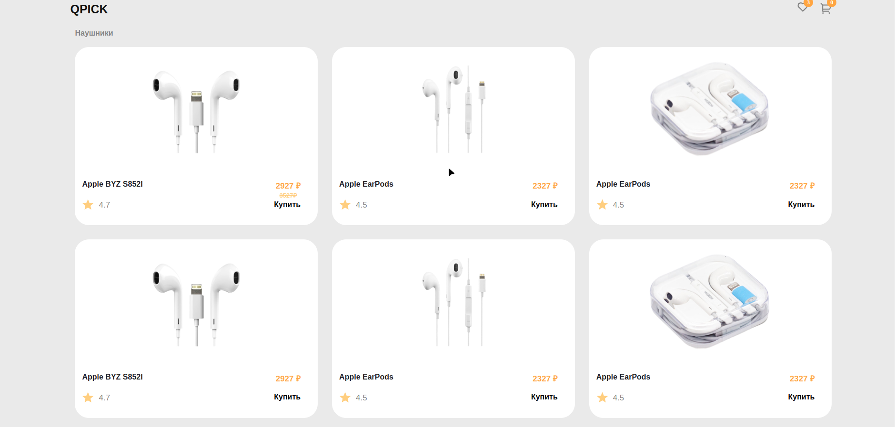
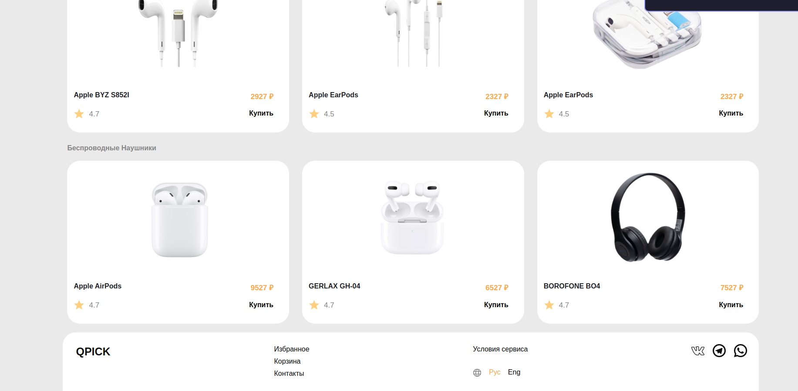
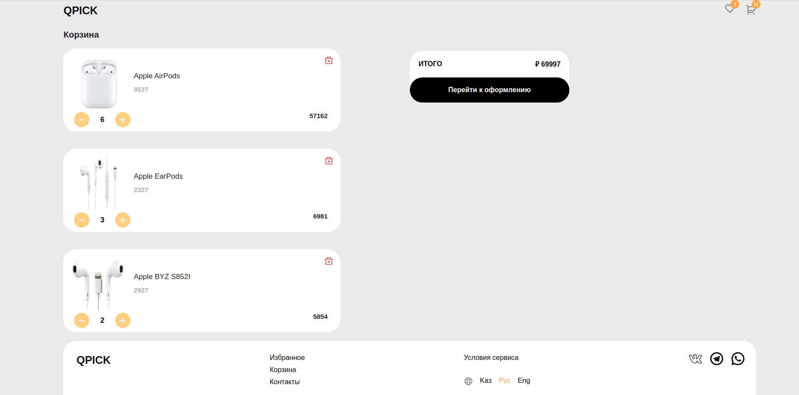

# Тестовое задание

1. Необходимо разработать две страницы интернет-магазина аудио аксессуаров. Первая страница –каталог товаров, вторая – корзина с приобретенными товарами; (Использование TS приветствуется). Для стилизации можете выбрать любойподход. (css, sass, styled-components, и т.д). Компоненты желательно продумывать с дальнейшим переиспользованием.
   
2. Необходимо реализовать удобный и масштабируемый роутинг;
   
3. Все элементы ссылок, иконок, должны отзываться при наведении на них (будет плюсом переход на какие либо соц-сети или вызов несуществующего номера);
   
4. Реализовать переход с корзины обратно домой (через logo или кнопкой возврата);
Макет доступен по ссылке Neoflex Invite Test (Copy) (Copy) – Figma

5. При нажатии на «Купить» в карточке на первой странице счетчик товаров рядом с
иконкой корзины должен увеличиваться

6. При изменении количества товаров в корзине, сумма и кол-во товаров должна изменяться
   
7. Обязательным условием является хранение данных о каждом товаре в виде элемента массива,
например:
# neoflex_test_vue

## Project setup

```

npm install

```

  

### Compiles and hot-reloads for development

```

npm run serve

```

  

### Compiles and minifies for production

```

npm run build

```

  

### Lints and fixes files

```

npm run lint

```

  

### Customize configuration

See [Configuration Reference](https://cli.vuejs.org/config/).


# Example






